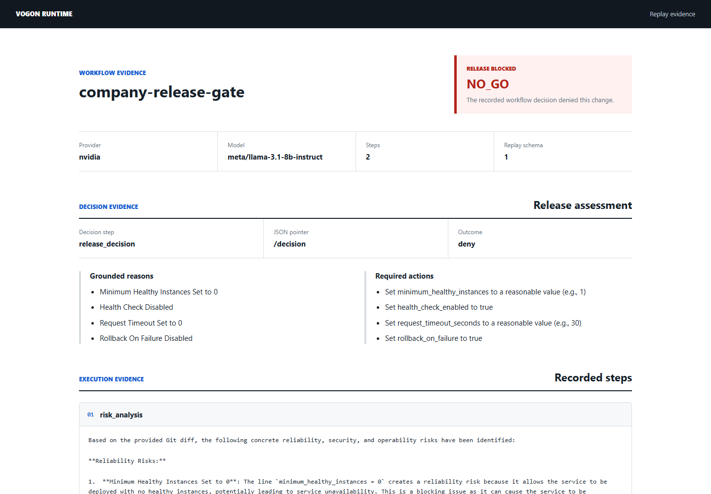

# Vogon Runtime

[](https://github.com/kaleab-kali/vogon-runtime/actions/workflows/ci.yml)

Vogon Runtime is a Rust runtime for deterministic, replayable AI workflows.

The project is built around a simple idea: an AI workflow should produce an
artifact that can be inspected, verified, and replayed later. Instead of treating
prompt chains as opaque scripts, Vogon records each workflow step, its inputs,
its outputs, and stable hashes that make drift visible.

## Why This Exists

LLM applications often become hard to debug as soon as they include multiple
steps, provider calls, retries, tool outputs, and prompt changes. A result may
look correct today and become impossible to explain tomorrow.

Vogon Runtime aims to make those workflows easier to operate by providing:

- Ordered workflow execution.
- A clean model adapter boundary.
- Deterministic fake models for local development and tests.
- Replay logs that capture step-level inputs, outputs, and hashes.
- Literal redaction for known sensitive output values.
- Verification tools that compare a new run against a saved replay.
- Trace output for debugging and observability.

## Project Status

Vogon Runtime's latest public release is `v0.1.4`; `v0.1.0` was the first
public release. The project is still in the `0.x` series, so command and
library APIs may change as the runtime stabilizes. The current codebase is a
small Rust workspace with:

- `vogon-core` for workflow, runtime, replay, hashing, and error types.
- `vogon-adapters` for deterministic local execution and provider-backed
  adapters such as Gemini.
- `vogon-cli` for running workflows, verification, traces, and evidence reports.
- `fixtures` for example workflows and replay logs.
- `docs` for architecture, workflow format, determinism, and replay format
  notes.

The deterministic adapter remains the default so workflows, replays, and
verification can be developed without network access. The CLI can also run and
verify workflows with the Gemini API when `GEMINI_API_KEY` is set, or with an
OpenAI-compatible chat-completions endpoint when `OPENAI_COMPATIBLE_API_KEY` is
set. It also includes a Groq preset for Groq's OpenAI-compatible endpoint when
`GROQ_API_KEY` is set, and a Hugging Face preset for Hugging Face Inference
Providers when `HF_TOKEN` is set. OpenRouter is available as a first-class
preset when `OPENROUTER_API_KEY` is set. NVIDIA API Catalog is available as a
first-class CLI and adapter preset using `NVIDIA_API_KEY`.

## Requirements

- Rust 1.85.0 or newer.
- Cargo with access to the committed `Cargo.lock` dependencies.

## Quickstart

Run the deterministic demo workflow:

```sh
cargo run -p vogon-cli -- demo
```

Create a starter workflow file:

```sh
cargo run -p vogon-cli -- init --output workflow.toml
cargo run -p vogon-cli -- check workflow.toml
```

Run a TOML workflow file:

```sh
cargo run -p vogon-cli -- run fixtures/workflows/support-triage.toml
```

Review the current tracked Git changes without copying a diff into the workflow:

```sh
cargo run -p vogon-cli -- check fixtures/workflows/git-change-review.toml
cargo run -p vogon-cli -- run --git-diff fixtures/workflows/git-change-review.toml
```

For pull request CI, compare the checked-out head with a trusted base revision:

```sh
cargo run -p vogon-cli -- run --git-diff-base origin/main fixtures/workflows/git-change-review.toml
```

The workflow references the injected context as `{{input.git_diff}}`. Literal
and UTF-8 file inputs are also available through repeatable
`--input NAME=VALUE` and `--input-file NAME=FILE` options.

Run a pull request release gate that exits nonzero on `NO_GO` and writes the
decision evidence to a replay:

```sh
cargo run -p vogon-cli -- run --provider nvidia --git-diff-base origin/main --enforce-decision --output target/release-gate.replay.json fixtures/workflows/release-gate.toml
```

The workflow policy selects a final-step JSON field with an RFC 6901 JSON
Pointer and lists exact allow and deny values. Markdown-wrapped JSON, a missing
field, a non-string value, or an unlisted value fails closed. This makes the
exit status suitable for CI, but the decision remains a model judgment and
must not replace deterministic tests, static analysis, or required human
review.

Render a replay as a self-contained HTML evidence page for reviewers:

```sh
cargo run -p vogon-cli -- report --output target/release-gate.html target/release-gate.replay.json
```

Report generation is offline and recomputes every recorded output hash and the
aggregate run hash before writing HTML. The result is a readable evidence
artifact, not a digital signature or proof that a model decision is correct.

Restrict where a workflow may run and how much output any step may feed into
the replay or next step:

```toml
[execution]
allowed_providers = ["nvidia"]
allowed_models = ["meta/llama-3.1-8b-instruct"]
max_step_output_bytes = 65536
```

Provider and model allowlists are checked before the first adapter call.
The output limit applies to fresh and cached raw UTF-8 responses. It prevents
oversized replay and prompt propagation, but it is checked after a provider
responds and therefore does not cap generation cost or response-body memory.

For a complete company-facing example, including an external Git repository
smoke, an NVIDIA release decision, and a pull request job, see the
[company release gate](examples/company-release-gate/README.md).

The report below came from the authorized NVIDIA run against the example's
synthetic unsafe payments deployment. It blocked the release and preserved the
model's grounded reasons and required actions as reviewable evidence.



The initial target is platform and release teams that need a supervised,
Git-native AI decision gate in pull request CI. Vogon is not a replacement for
deterministic scanners, production observability platforms, evaluation suites,
or durable agent orchestrators. The
[product fit and launch readiness guide](https://github.com/kaleab-kali/vogon-runtime/blob/main/docs/product-fit.md)
gives a direct comparison with Promptfoo, LangSmith, Braintrust, LangGraph,
Temporal, and a small CI script.

Check available providers, credential setup, and provider documentation links
without running a workflow. Provider-backed entries also include public usage,
pricing, or rate-limit links when available:

```sh
cargo run -p vogon-cli -- providers
```

Run local installation diagnostics without making network calls:

```sh
cargo run -p vogon-cli -- doctor
```

Provider credential names are listed in `.env.example`. Keep committed values
blank; the CLI reads credentials from the process environment and does not load
`.env` files by itself.

Run a workflow with the Gemini API instead of the deterministic adapter:

```sh
GEMINI_API_KEY=... cargo run -p vogon-cli -- run --provider gemini fixtures/workflows/support-triage.toml
```

Run a workflow with an OpenAI-compatible chat-completions endpoint:

```sh
OPENAI_COMPATIBLE_API_KEY=... cargo run -p vogon-cli -- run --provider openai-compatible fixtures/workflows/support-triage.toml
```

Run against a local Ollama OpenAI-compatible endpoint without creating a fake
credential:

```sh
cargo run -p vogon-cli -- run --provider openai-compatible --openai-compatible-base-url http://localhost:11434/v1 --openai-compatible-model llama3.2 --openai-compatible-no-auth fixtures/workflows/support-triage.toml
```

Use no-auth mode only for an endpoint you intentionally trust. Authenticated
OpenAI-compatible services still require `OPENAI_COMPATIBLE_API_KEY` by
default. Hosted endpoints must use HTTPS; plain HTTP is accepted only for
loopback hosts such as `localhost`, `127.0.0.1`, and `::1`.

Run a workflow with Groq's OpenAI-compatible endpoint:

```sh
GROQ_API_KEY=... cargo run -p vogon-cli -- run --provider groq fixtures/workflows/support-triage.toml
```

Run a workflow with Hugging Face Inference Providers:

```sh
HF_TOKEN=... cargo run -p vogon-cli -- run --provider hugging-face fixtures/workflows/support-triage.toml
```

Run a workflow with OpenRouter:

```sh
OPENROUTER_API_KEY=... cargo run -p vogon-cli -- run --provider openrouter fixtures/workflows/support-triage.toml
```

Run against NVIDIA's hosted OpenAI-compatible API with an NVIDIA Developer API
key:

```sh
NVIDIA_API_KEY=... cargo run -p vogon-cli -- run --provider nvidia fixtures/workflows/support-triage.toml
```

Use `--nvidia-model` to select another current NVIDIA API Catalog model.

For a real-provider smoke path with the lowest setup friction, start with
OpenRouter's `openrouter/free` default, Gemini's documented free API tier, or
Hugging Face's routed Inference Providers credits, or NVIDIA's hosted API
Catalog with a Developer API key. Groq also publishes free-plan rate limits for
supported models. Provider terms and limits change, so verify the linked
provider docs before relying on any free tier for deployment.

The default OpenAI-compatible base URL is Hugging Face Inference Providers'
OpenAI-compatible router, and the default model is
`openai/gpt-oss-120b:fastest`. Override both for OpenRouter or another
compatible service:

```sh
OPENAI_COMPATIBLE_API_KEY=... cargo run -p vogon-cli -- run --provider openai-compatible --openai-compatible-base-url https://openrouter.ai/api/v1 --openai-compatible-model openai/gpt-5.2 fixtures/workflows/support-triage.toml
```

Gemini requests use a 30 second timeout by default. Override it when needed:

```sh
GEMINI_API_KEY=... cargo run -p vogon-cli -- run --provider gemini --gemini-timeout-seconds 60 fixtures/workflows/support-triage.toml
```

Transient Gemini transport failures and retryable HTTP responses are retried
twice by default. Valid `Retry-After` response headers are honored up to 30
seconds; otherwise retries use exponential backoff with jitter. Use
`--gemini-max-retries 0` to disable retries or another value up to `20` to tune
retry behavior. Permanent configuration, TLS, redirect, and response-decoding
errors are returned immediately instead of consuming retry attempts.

OpenAI-compatible requests also use a 30 second timeout and two retry attempts
by default, with the same bounded `Retry-After` handling. Use
`--openai-compatible-timeout-seconds` and
`--openai-compatible-max-retries` to tune those bounds.

Groq requests use the same default timeout and retry count. Use
`--groq-model`, `--groq-timeout-seconds`, and `--groq-max-retries` when a
workflow needs a different Groq model or stricter network bounds.

Hugging Face requests also use the same default timeout and retry count. Use
`--hugging-face-model`, `--hugging-face-timeout-seconds`, and
`--hugging-face-max-retries` when a workflow needs a different model or stricter
network bounds.

OpenRouter requests default to `https://openrouter.ai/api/v1` with the
`openrouter/free` router. Use `--openrouter-model`,
`--openrouter-timeout-seconds`, and `--openrouter-max-retries` when a workflow
needs a specific OpenRouter model or stricter network bounds.

Validate a TOML workflow without executing it:

```sh
cargo run -p vogon-cli -- check fixtures/workflows/support-triage.toml
```

Emit a machine-readable workflow validation summary:

```sh
cargo run -p vogon-cli -- check --json fixtures/workflows/support-triage.toml
```

Write a replay file:

```sh
cargo run -p vogon-cli -- run --output target/support-triage.replay.json fixtures/workflows/support-triage.toml
```

Persist a bounded cache for repeated runs:

```sh
cargo run -p vogon-cli -- run --cache-file target/vogon.cache.json fixtures/workflows/support-triage.toml
```

Cache files may contain raw provider outputs, including values redacted from
replay files. Store them privately and do not commit them.

Redact known sensitive literals from replay outputs:

```sh
cargo run -p vogon-cli -- run --redact api_key=sk-test-123 fixtures/workflows/support-triage.toml
```

For credentials and other environment-only secrets, reference the variable
name instead of placing the value in process arguments:

```sh
cargo run -p vogon-cli -- run --redact-env api_key=PROVIDER_API_KEY fixtures/workflows/support-triage.toml
```

Verify a saved replay:

```sh
cargo run -p vogon-cli -- verify fixtures/workflows/support-triage.toml fixtures/replays/support-triage.replay.json
```

`vogon verify` uses the provider metadata recorded in current replay files by
default. Pass `--provider` and provider-specific flags when intentionally
checking a replay against a different adapter.

Reuse the private cache created with the original provider run to verify exact
outputs without another API call:

```sh
cargo run -p vogon-cli -- verify --cache-file target/vogon.cache.json fixtures/workflows/support-triage.toml target/support-triage.replay.json
```

The cache identity includes the provider, endpoint, model, and runtime
configuration. A missing or nonmatching entry causes normal provider
execution; it does not silently accept the saved replay as actual output.

For a live-provider smoke check where wording may vary, compare workflow
structure instead of exact outputs:

```sh
cargo run -p vogon-cli -- verify --mode structure workflow.toml target/review.replay.json
```

Structural mode still executes every step and compares provider metadata,
ordered step IDs, and hashes of every rendered prompt. It ignores run, input,
and output hashes plus output text. It therefore proves that the same rendered
workflow completes against the same provider configuration; it does not prove
that the model's answer is correct. Replays created before prompt hashes were
introduced must be regenerated before structural verification.

Emit a machine-readable verification report with `workflow_name`, `is_match`,
`mode`, and `mismatches` fields:

```sh
cargo run -p vogon-cli -- verify --json fixtures/workflows/support-triage.toml fixtures/replays/support-triage.replay.json
```

When verifying redacted replays, pass the same `--redact LABEL=VALUE` or
`--redact-env LABEL=ENV_VAR` rules used to create the replay. Vogon rejects
redacted replays with missing redaction labels before execution and masks
actual step outputs in redacted mismatch reports. Redaction labels must be
unique within one command.

Verify a multi-step writing workflow fixture:

```sh
cargo run -p vogon-cli -- verify fixtures/workflows/writing-pipeline.toml fixtures/replays/writing-pipeline.replay.json
```

Inspect a replay trace:

```sh
cargo run -p vogon-cli -- trace fixtures/replays/support-triage.replay.json
```

Export a machine-readable JSON Lines trace:

```sh
cargo run -p vogon-cli -- trace --jsonl fixtures/replays/support-triage.replay.json
```

Redact known sensitive literals while inspecting traces:

```sh
cargo run -p vogon-cli -- trace --redact api_key=sk-test-123 fixtures/replays/support-triage.replay.json
```

Run local checks:

```sh
cargo fmt --all -- --check
cargo clippy --workspace --all-targets --all-features --locked -- -D warnings
cargo test --workspace --all-features --locked
cargo check -p vogon-cli --no-default-features --locked
cargo test -p vogon-xtask --locked spdx_sbom
cargo test -p vogon-xtask --locked spdx_sbom_json
cargo test -p vogon-xtask --locked container_image
cargo test -p vogon-xtask --locked cache_json
cargo run -p vogon-xtask -- check-docs-links --root .
cargo run -p vogon-xtask -- check-issue-templates --root .
cargo test -p vogon-xtask --locked live_replay
cargo test -p vogon-xtask --locked live_workflow
cargo test -p vogon-xtask --locked release_workflow
cargo run -p vogon-xtask -- check-cargo-manifests --root .
cargo run -p vogon-xtask -- check-changelog --root .
cargo run -p vogon-xtask -- check-contributing-checklist --root .
cargo run -p vogon-xtask -- check-deployment-checklist --root .
cargo run -p vogon-xtask -- check-docs-links --root .
cargo run -p vogon-xtask -- check-public-status-docs --root .
cargo run -p vogon-xtask -- check-env-example --root .
cargo run -p vogon-xtask -- check-issue-templates --root .
cargo run -p vogon-xtask -- check-container-policy --root .
cargo run -p vogon-xtask -- check-dependabot-config --root .
cargo run -p vogon-xtask -- check-live-workflows --root .
cargo run -p vogon-xtask -- check-package-verification-docs --root .
cargo run -p vogon-xtask -- check-pr-template --root .
cargo run -p vogon-xtask -- check-release-checklist --root .
cargo run -p vogon-xtask -- check-release-workflow --root .
cargo run -p vogon-xtask -- check-schema-files --root .
cargo run -p vogon-xtask -- check-secrets --root .
cargo run -p vogon-xtask -- check-rust-first-tooling --root .
cargo run -p vogon-xtask -- check-ci-workflow --root .
cargo run -p vogon-xtask -- check-security-workflows --root .
cargo run -p vogon-xtask -- check-workflow-policies --root .
cargo +1.85.0 test --workspace --all-features --locked
cargo bench -p vogon-core --bench runtime --locked -- --iterations 100 | cargo run -p vogon-xtask -- check-benchmark-output --expected-iterations 100 --max-elapsed-ms 10000
cargo build --release --workspace --all-features --locked
cargo run --release -p vogon-cli -- doctor --json | cargo run -p vogon-xtask -- check-doctor-json
cargo run --release -p vogon-cli -- providers --json | cargo run -p vogon-xtask -- check-providers-json
cargo run --release -p vogon-cli -- init --force --output target/vogon-init-smoke/workflow.toml
cargo run --release -p vogon-cli -- check --json target/vogon-init-smoke/workflow.toml | cargo run -p vogon-xtask -- check-workflow-json --expected-workflow-name starter-workflow --expected-step-count 2
cargo run --release -p vogon-cli -- check --json fixtures/workflows/support-triage.toml | cargo run -p vogon-xtask -- check-workflow-json --expected-workflow-name support-triage --expected-step-count 2
cargo run --release -p vogon-cli -- verify --json fixtures/workflows/support-triage.toml fixtures/replays/support-triage.replay.json | cargo run -p vogon-xtask -- check-verify-json --expected-workflow-name support-triage --expect-match
cargo run --release -p vogon-cli -- verify fixtures/workflows/support-triage.toml fixtures/replays/support-triage.replay.json
cargo run --release -p vogon-cli -- verify fixtures/workflows/writing-pipeline.toml fixtures/replays/writing-pipeline.replay.json
cargo run --release -p vogon-cli -- trace --jsonl fixtures/replays/support-triage.replay.json | cargo run -p vogon-xtask -- check-trace-jsonl --expected-provider deterministic --expected-model deterministic-echo --expected-step-count 2
cargo run --release -p vogon-cli -- run --cache-file target/vogon-cache-smoke.cache.json --cache-max-entries 1 fixtures/workflows/support-triage.toml
cargo run -p vogon-xtask -- check-cache-json target/vogon-cache-smoke.cache.json --expected-max-entries 1 --expected-entry-count 1
cargo install --path crates/vogon-cli --locked --offline --root target/install-smoke --force
target/install-smoke/bin/vogon --version
target/install-smoke/bin/vogon doctor --json | cargo run -p vogon-xtask -- check-doctor-json
target/install-smoke/bin/vogon providers --json | cargo run -p vogon-xtask -- check-providers-json
target/install-smoke/bin/vogon init --force --output target/install-smoke-workflow.toml
target/install-smoke/bin/vogon check --json target/install-smoke-workflow.toml | cargo run -p vogon-xtask -- check-workflow-json --expected-workflow-name starter-workflow --expected-step-count 2
target/install-smoke/bin/vogon check --json fixtures/workflows/support-triage.toml | cargo run -p vogon-xtask -- check-workflow-json --expected-workflow-name support-triage --expected-step-count 2
target/install-smoke/bin/vogon run --cache-file target/install-smoke.cache.json --cache-max-entries 1 fixtures/workflows/support-triage.toml
cargo run -p vogon-xtask -- check-cache-json target/install-smoke.cache.json --expected-max-entries 1 --expected-entry-count 1
target/install-smoke/bin/vogon verify fixtures/workflows/support-triage.toml fixtures/replays/support-triage.replay.json
target/install-smoke/bin/vogon verify fixtures/workflows/writing-pipeline.toml fixtures/replays/writing-pipeline.replay.json
docker build --tag vogon-runtime:smoke .
cargo run -p vogon-xtask -- check-container-image vogon-runtime:smoke
docker run --rm vogon-runtime:smoke --version
docker run --rm --read-only vogon-runtime:smoke --version
docker run --rm --read-only vogon-runtime:smoke doctor --json | cargo run -p vogon-xtask -- check-doctor-json
docker run --rm --read-only vogon-runtime:smoke providers --json | cargo run -p vogon-xtask -- check-providers-json
mkdir -p target/container-smoke
chmod 777 target/container-smoke
docker run --rm --read-only -v "$PWD/target/container-smoke:/work" vogon-runtime:smoke init --force --output /work/starter.toml
docker run --rm --read-only -v "$PWD/target/container-smoke:/work:ro" vogon-runtime:smoke check --json /work/starter.toml | cargo run -p vogon-xtask -- check-workflow-json --expected-workflow-name starter-workflow --expected-step-count 2
docker run --rm --read-only -v "$PWD:/work:ro" vogon-runtime:smoke check --json fixtures/workflows/support-triage.toml | cargo run -p vogon-xtask -- check-workflow-json --expected-workflow-name support-triage --expected-step-count 2
docker run --rm --read-only -v "$PWD:/work:ro" vogon-runtime:smoke verify --json fixtures/workflows/support-triage.toml fixtures/replays/support-triage.replay.json | cargo run -p vogon-xtask -- check-verify-json --expected-workflow-name support-triage --expect-match
docker run --rm --read-only -v "$PWD:/work:ro" vogon-runtime:smoke trace --jsonl fixtures/replays/support-triage.replay.json | cargo run -p vogon-xtask -- check-trace-jsonl --expected-provider deterministic --expected-model deterministic-echo --expected-step-count 2
RUSTDOCFLAGS="-D warnings" cargo doc --workspace --all-features --no-deps --locked
cargo package -p vogon-core --allow-dirty --offline --locked
cargo package --workspace --allow-dirty --no-verify --offline --locked
```

The package command uses `--no-verify` for the offline workspace check because
Cargo can fail offline verification while resolving unpublished internal
workspace crates. The preceding build, test, docs, install, and smoke commands
still verify compilation and CLI behavior before maintainers inspect package
contents.

## Repository Layout

```text
crates/
  vogon-core/      Workflow, runtime, replay, hashing, and errors.
  vogon-adapters/  Model adapter implementations and runtime examples.
  vogon-cli/       Command-line entrypoint.
docs/              Architecture, format, and determinism notes.
fixtures/          Example workflows and replay logs.
```

Useful documentation:

- [Architecture](https://github.com/kaleab-kali/vogon-runtime/blob/main/docs/architecture.md)
- [CLI reference](https://github.com/kaleab-kali/vogon-runtime/blob/main/docs/cli.md)
- [Provider adapters](https://github.com/kaleab-kali/vogon-runtime/blob/main/docs/providers.md)
- [Deployment](https://github.com/kaleab-kali/vogon-runtime/blob/main/docs/deployment.md)
- [Workflow format](https://github.com/kaleab-kali/vogon-runtime/blob/main/docs/workflow-format.md)
- [Determinism](https://github.com/kaleab-kali/vogon-runtime/blob/main/docs/determinism.md)
- [Replay format](https://github.com/kaleab-kali/vogon-runtime/blob/main/docs/replay-format.md)
- [Schemas](https://github.com/kaleab-kali/vogon-runtime/blob/main/docs/schemas.md)
- [Performance](https://github.com/kaleab-kali/vogon-runtime/blob/main/docs/performance.md)
- [Product fit and launch readiness](https://github.com/kaleab-kali/vogon-runtime/blob/main/docs/product-fit.md)
- [Release process](https://github.com/kaleab-kali/vogon-runtime/blob/main/docs/release.md)
- [Support](https://github.com/kaleab-kali/vogon-runtime/blob/main/SUPPORT.md)

## Design Principles

- Determinism first: local tests and replay verification should not require a
  network call.
- Provider isolation: provider-specific code should stay outside the core
  runtime.
- Inspectable artifacts: replay logs should be readable and stable enough to
  debug.
- Small public surface: the runtime API should be clear before adding workflow
  graph support, caching, retries, or provider configuration.

## Roadmap

Already available:

- Rust workspace and CLI.
- Ordered workflow execution.
- Starter workflow generation with `vogon init`.
- Opt-in Gemini API execution for real provider-backed runs.
- Opt-in OpenAI-compatible chat-completions execution for providers such as
  Hugging Face Inference Providers and OpenRouter.
- Opt-in Groq execution through Groq's OpenAI-compatible endpoint.
- Opt-in Hugging Face execution through Hugging Face Inference Providers'
  OpenAI-compatible endpoint.
- Opt-in NVIDIA execution through NVIDIA API Catalog's hosted
  OpenAI-compatible endpoint.
- Opt-in OpenRouter execution through OpenRouter's OpenAI-compatible endpoint.
- Manual live Gemini smoke testing for maintainers with `GEMINI_API_KEY`
  configured in GitHub Actions.
- Manual live OpenAI-compatible smoke testing for maintainers with
  `OPENAI_COMPATIBLE_API_KEY` configured in GitHub Actions.
- Manual live Groq smoke testing for maintainers with `GROQ_API_KEY`
  configured in GitHub Actions.
- Manual live Hugging Face smoke testing for maintainers with `HF_TOKEN`
  configured in GitHub Actions.
- Manual live NVIDIA smoke testing for maintainers with `NVIDIA_API_KEY`
  configured in GitHub Actions.
- Manual live OpenRouter smoke testing for maintainers with
  `OPENROUTER_API_KEY` configured in GitHub Actions.
- Deterministic replay log generation.
- Provider-aware replay verification with structured mismatch errors.
- Exact and output-insensitive structural replay verification.
- Strict workflow decision policies with replay evidence and CI exit enforcement.
- Workflow provider/model allowlists and bounded step-output propagation.
- Offline, self-contained HTML evidence reports with replay integrity checks.
- Contributor-ready fixtures and examples.
- Human-readable and JSON Lines replay trace output.
- Provider-neutral runtime observer events for step lifecycle, replay mismatch,
  and cache hit/miss status.
- Strict named workflow inputs from literals, UTF-8 files, current Git changes,
  or pull request base diffs.

Planned:

- Add more provider-backed adapters behind feature flags.
- Add workflow graph support after the linear runtime API is stable.
- Add richer provider configuration policies.
- Add hosted runtime observability export integrations.

## License

Vogon Runtime is released under the MIT License.
